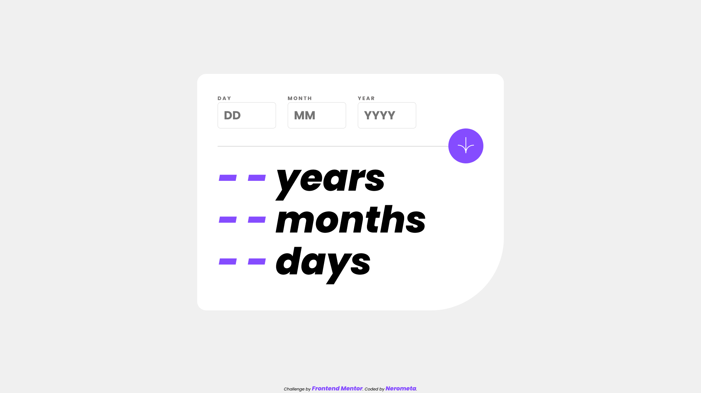

# Frontend Mentor - Age calculator app solution

This is a solution to the [Age calculator app challenge on Frontend Mentor](https://www.frontendmentor.io/challenges/age-calculator-app-dF9DFFpj-Q). Frontend Mentor challenges help you improve your coding skills by building realistic projects.

## Table of contents

-   [Frontend Mentor - Age calculator app solution](#frontend-mentor---age-calculator-app-solution)
    -   [Table of contents](#table-of-contents)
    -   [Overview](#overview)
        -   [Screenshot](#screenshot)
        -   [Links](#links)
    -   [My process](#my-process)
        -   [Built with](#built-with)
        -   [What I learned](#what-i-learned)
    -   [Author](#author)
    -   [Acknowledgments](#acknowledgments)

**Note: Delete this note and update the table of contents based on what sections you keep.**

## Overview

### Screenshot



### Links

-   Solution URL: [Add solution URL here](https://your-solution-url.com)
-   Live Site URL: [Add live site URL here](https://your-live-site-url.com)

## My process

### Built with

-   HTML5
-   CSS3 (Flexbox & Grid)
-   JavaScript

### What I learned

Start with our inputs. I use number input for this and it came with arrows. I removed it with this CSS code:

```css
.input-field input {
	appearance: none;
	-moz-appearance: textfield;
}
```

Then, I ran into another problem: I cannot limit digits for my input. That only works for text. So this is another piece of code I found:

```html
<input oninput="this.value=this.value.slice(0,this.maxLength)" maxlength="2" />
```

The main gist is the function inside `oninput`. Essentially, it will receive the value we put in and use `slice()` to, well, slice any excess digits according to our `maxlength` value.

---

I did have a lot to take in when it comes to JavaScript. So, I looked into [another person's solution](https://github.com/Syfrost/Age-calculator-app-FM) I find in frontendmentor.io. I use most of the code in his script and adjust here and there to my liking. It makes so much sense.

## Author

-   Website - [nerometa](https://github.com/nerometa)
-   Frontend Mentor - [@nerometa](https://www.frontendmentor.io/profile/nerometa)

## Acknowledgments

-   [Age calculator app by Cédric G
    ](https://github.com/Syfrost/Age-calculator-app-FM) - This helped me with JavaScript a LOT. Check out his code.
